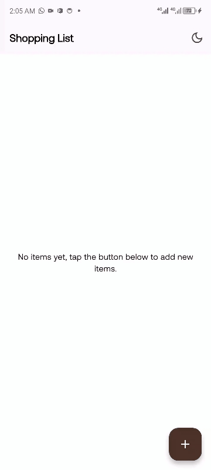
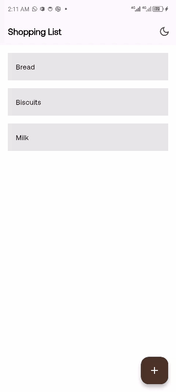
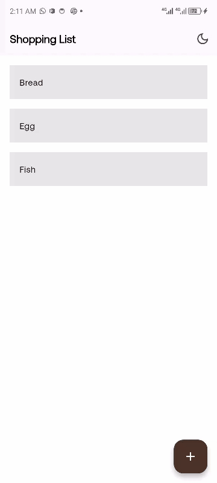
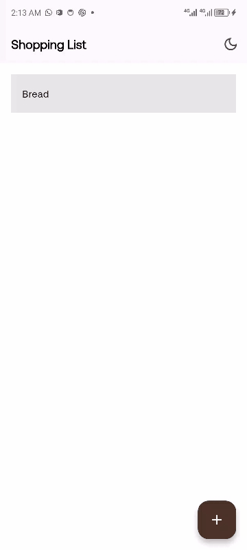

# Afrifounders App

## Overview
This Flutter application is a tehcnical assessment task for Fluter Developer Role at Afrihub Startup Studio. It is a simple shopping list manager that allows users to add, edit, and delete shopping items. It uses Riverpod for state management and SharedPreferences for local data persistence. The app also includes a dark mode toggle that updates the entire app theme dynamically and saves the user preference.

---

## Download APK (Beta)

If you want to try the Android app quickly, download the latest APK:

[](https://drive.google.com/file/d/1TDDwytPG_dOeSPckULPDvqQn2bC3obiP/view?usp=drive_link)

---

## Objectives Fulfilled

### 1. Display a List of Items
The home screen displays a scrollable list of shopping items. Each item is represented using a ListTile widget. Users can view all added items in an organized list format.

**Screenshot**
<p align="left">

</p>

---

### 2. Add New Items
A floating action button is available on the home screen. When pressed, it opens a new screen that allows users to input and save a new shopping item. The new item appears immediately in the list after saving.

**GIF**
<p align="left">

</p>

---

### 3. Edit Existing Items
Tapping on any item in the list opens the edit screen. The user can modify the name of the selected shopping item and save changes. The updated data is instantly reflected in the main list.

**GIF**
<p align="left">

</p>

---

### 4. Delete Items with Swipe Gesture
Users can remove any item from the list by swiping it from right to left. The dismissed item is permanently deleted and the updated list is saved locally.

**GIF**
<p align="left">

</p>

---

### 5. State Management with Riverpod
The application uses Riverpod’s `StateNotifierProvider` for managing the shopping list and theme state. This ensures efficient reactivity and a clear separation between UI and logic.

**Implementation Highlights**
- `shoppingControllerProvider` manages adding, editing, deleting, and loading items.
- `themeControllerProvider` manages the app’s theme mode and persists it using SharedPreferences.

---

### 6. Persistent Local Storage using SharedPreferences
All items and the selected theme mode are saved locally on the device using the SharedPreferences package. This ensures that the user’s data and preferences remain available even after restarting the app.

**Implementation Details**
- Items are serialized to JSON and stored as a list of strings.
- Theme mode (light or dark) is stored as a boolean value.

---

### 7. Dark Mode Toggle
A toggle button in the AppBar allows switching between light and dark modes. The selected mode affects the entire application immediately and is persisted in SharedPreferences.

**GIF**
<p align="left">

</p>

---

### 8. Refactored widgets
The widget in home screen and edit screen have been refactored in to smaller files in order to create a clean code structure.
The folder structure bellow explains how the files are organized.


```

lib/
├── app/
│   ├── app.dart
│   └── theme/
│       ├── theme.dart
│       └── text_theme.dart
├── constants/
│   ├── custom_colors.dart
│   └── custom_sizes.dart
│   ├── helper_function.dart
│   └── responsive_size.dart
├── controllers/
│   ├── shopping_controller.dart
│   └── theme_controller.dart
├── features/
│   └── data/
│       ├── local_storage/
│           └── shopping_local_storage.dart
│       └── models/
│           └── shopping_item.dart
│   └── screens/
│       ├── home_screen.dart
│       └── edit_item_screen.dart
│   └── widgets/
│       ├── edit_item_form.dart
│       ├── shopping_item_tile.dart
│       └── shopping_list.dart
└── main.dart


```

## Developer Guide — Clone & Run

### Prerequisites
- Flutter SDK (stable channel) and Android SDK
- A GitHub account (for cloning/pushing)
- Optional: `flutter_dotenv` for environment variables in Flutter

1. Clone the repository
```
   git clone https://github.com/ahmvddddd/afrifounders_app.git
```
Navigate to the project directory:
```
cd afrifounders_app
```

2. Install dependencies
Run the following command to fetch all the packages:
```
flutter pub get
```

3. Run the app
Make sure a device or emulator is running, then execute:
```
flutter run
```

4. Build APK (Android)
To build a release APK:
```
flutter build apk
```
Build for iOS (MacOS only)
To build the app for iOS:
```
flutter build ios
```

5. Troubleshooting
Run flutter doctor to check for setup issues:
```
flutter doctor

```
To clean the build:
```
flutter clean
flutter pub get

```
